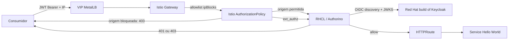

# Guia de implementação: JWT, roles e IP/CIDR sem alterar a aplicação

## Resultado

O ambiente demonstrado publica uma aplicação HTTP simples em dois endpoints:

| Condição | Resultado esperado |
|---|---:|
| Origem fora da allowlist, mesmo com JWT e role válidos | 403 |
| Origem permitida, sem token | 401 |
| Origem permitida, `blue` em `GET /blue` | 200 |
| Origem permitida, `blue` em `GET /red` | 403 |
| Origem permitida, `red` em `GET /red` | 200 |

A aplicação executa uma imagem HTTP genérica e não contém biblioteca, filtro,
configuração ou linha de código de autenticação. O gateway recebe a requisição,
o RHCL/Authorino valida a assinatura e o emissor do JWT, e uma regra OPA avalia
as roles antes que o tráfego seja encaminhado ao `Service`.

O cluster foi validado com OpenShift 4.22, RHCL 1.4.3, OpenShift Service Mesh
3.4.2/Istio 1.30.4 e Red Hat build of Keycloak 26.4. RHCL 1.4 suporta OCP 4.22;
a recomendação oficial para a linha 1.4 é usar 1.4.1 ou posterior.

## Arquitetura



O `Service` `LoadBalancer` do Gateway recebe um VIP do MetalLB. O `Gateway` e o
`HTTPRoute` são os recursos Gateway API efetivamente protegidos; o `AuthPolicy`
fica no mesmo namespace do `HTTPRoute` e aponta para ele com `targetRef`.

Leia também o guia de [allowlist de IP/CIDR](source-cidr-allowlist.md),
[arquitetura e decisões](architecture.md) e a [matriz de rastreabilidade](traceability.md).

## Ordem de instalação

Os manifestos foram aplicados nesta ordem:

1. `00-operators.yaml` instala os operadores Service Mesh 3.4 e RHCL 1.4.
2. `00b-metallb-operator.yaml` instala o operador MetalLB.
3. `01-service-mesh.yaml` cria `IstioCNI` e o control plane Istio.
4. `01a-metallb.yaml` cria a instância MetalLB, o pool reservado e o anúncio L2.
5. `01b-connectivity-link.yaml` instancia o CR `Kuadrant`, que cria Authorino
   e Limitador.
6. Crie os `Secret`s do cliente e dos usuários, então aplique
   `02-keycloak.yaml`. O `KeycloakRealmImport` requer estar no namespace que o
   operador Keycloak observa.
7. `03-hello-gateway.yaml` cria aplicação, `Service`, `Gateway` e `HTTPRoute`;
   o serviço gerado para o gateway é `LoadBalancer`.
8. `03b-gateway-loadbalancer.yaml` define `externalTrafficPolicy: Local` no
   serviço gerado, preservando o endereço de origem.
9. `04-authpolicy.yaml` aplica validação OIDC e RBAC no `HTTPRoute`.
10. `05-source-cidr-authorization.yaml` aplica a allowlist de origem no
    `Gateway`.

Em outro ambiente, troque os hosts `apps...` nos manifestos por nomes do seu
domínio. Crie segredos fora do Git (GitOps com External Secrets, Sealed Secrets
ou uma integração de cofre é o recomendado). Exemplo de criação local:

```bash
oc -n keycloak create secret generic hello-rbac-oidc-client \
  --from-literal=client-id=hello-rbac-client \
  --from-literal=client-secret="$(openssl rand -base64 48 | tr -d '\n')"

oc -n keycloak create secret generic hello-rbac-test-users \
  --from-literal=blue-password="$(openssl rand -base64 32 | tr -d '\n')" \
  --from-literal=red-password="$(openssl rand -base64 32 | tr -d '\n')"

oc apply -f manifests/02-keycloak.yaml
```

O importador de realms só cria realms novos; não atualiza um realm existente.
Para mudanças posteriores, use uma automação declarativa de administração do
Keycloak ou a Admin API, com credenciais em um cofre.

## Como consumir a API

Defina hosts para seu ambiente e obtenha os dados sem imprimi-los:

```bash
export KEYCLOAK_HOST=sso.apps.example.com
export API_HOST=hello-rbac.api.example.com
export GATEWAY_VIP=192.0.2.50
export REALM=hello-rbac
export CLIENT_ID="$(oc -n keycloak get secret hello-rbac-oidc-client -o jsonpath='{.data.client-id}' | base64 -d)"
export CLIENT_SECRET="$(oc -n keycloak get secret hello-rbac-oidc-client -o jsonpath='{.data.client-secret}' | base64 -d)"
export BLUE_PASSWORD="$(oc -n keycloak get secret hello-rbac-test-users -o jsonpath='{.data.blue-password}' | base64 -d)"
```

Emita um token para `blue-user` (troque usuário e senha por `red-user` e a chave
`red-password` para testar a outra role):

```bash
TOKEN="$(curl -fsS -X POST "https://${KEYCLOAK_HOST}/realms/${REALM}/protocol/openid-connect/token" \
  --data-urlencode grant_type=password \
  --data-urlencode client_id="$CLIENT_ID" \
  --data-urlencode client_secret="$CLIENT_SECRET" \
  --data-urlencode username=blue-user \
  --data-urlencode password="$BLUE_PASSWORD" | jq -r .access_token)"

curl --resolve "${API_HOST}:80:${GATEWAY_VIP}" -i \
  -H "Authorization: Bearer $TOKEN" "http://${API_HOST}/blue" # 200
curl --resolve "${API_HOST}:80:${GATEWAY_VIP}" -i \
  -H "Authorization: Bearer $TOKEN" "http://${API_HOST}/red"  # 403
```

Para produção, prefira `authorization_code` com PKCE para usuários humanos ou
`client_credentials` para integrações máquina-a-máquina. O fluxo de senha acima
existe somente para tornar a demonstração reproduzível.

## Validação e diagnóstico

```bash
oc get gateway,httproute,authpolicy -n hello-rbac
oc get authpolicy hello-rbac-jwt-and-roles -n hello-rbac \
  -o jsonpath='{.status.conditions[?(@.type=="Accepted")].status}{" "}{.status.conditions[?(@.type=="Enforced")].status}{"\n"}'
oc get kuadrant,authorino -n kuadrant-system
```

O resultado esperado para o último comando de política é `True True`. Se um
token válido retorna 401, confirme que `issuerUrl` é exatamente o valor de `iss`
do JWT e que o gateway alcança o discovery/JWKS do emissor. Se retorna 403,
decode o payload localmente e confira `realm_access.roles`; depois consulte os
logs do Authorino:

```bash
oc logs -n kuadrant-system -l authorino-resource=authorino --tail=100
```

## Segurança e operação

- O `client-secret`, senhas de teste e senha de administração são segredos de
  runtime; não devem aparecer em YAML, commits, logs ou tickets.
- Um `AuthPolicy` no `HTTPRoute` permite que cada time de aplicação tenha regra
  própria, enquanto um `AuthPolicy` no `Gateway` é adequado para um deny-all
  corporativo. A documentação RHCL recomenda o padrão deny-all para zero trust.
- A demonstração usa HTTP no VIP para reduzir o escopo. Para produção, defina
  um listener HTTPS no `Gateway`, certificado e DNS apontando para o VIP, além
  de mTLS de backend, rotação de certificados, alta disponibilidade para
  Keycloak e banco PostgreSQL externo.
- O predicado OPA é deliberadamente fechado: qualquer caminho fora de `/blue` e
  `/red`, role ausente ou claim incompatível é negado.
- A restrição de IP/CIDR é implementada antes do RHCL e é independente do JWT.
  O procedimento, pré-requisitos de rede e a validação pelo VIP estão no
  [guia específico](source-cidr-allowlist.md).

## Referências

- [RHCL 1.4 — visão geral e compatibilidade](https://docs.redhat.com/en/documentation/red_hat_connectivity_link/1.4/html/red_hat_connectivity_link/rhcl-introduction) — Red Hat, 1.4, consultado em 2026-09-23.
- [RHCL 1.4 — autenticação OIDC](https://docs.redhat.com/en/documentation/red_hat_connectivity_link/1.4/html/deploy_red_hat_connectivity_link/rhcl-oidc-authentication) — Red Hat, 1.4, consultado em 2026-09-23.
- [RHBK 26.4 — importação de realm e placeholders](https://docs.redhat.com/en/documentation/red_hat_build_of_keycloak/26.4/html-single/operator_guide/index) — Red Hat, 26.4, consultado em 2026-09-23.
- [Kuadrant 1.4 — AuthPolicy](https://docs.kuadrant.io/1.4.x/kuadrant-operator/doc/user-guides/auth/auth-for-app-devs-and-platform-engineers/) — documentação community, consultada em 2026-09-23.
