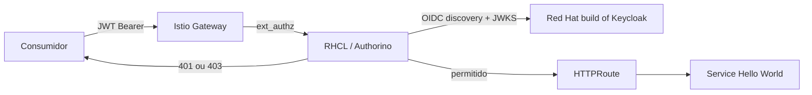

# OIDC/JWT e RBAC por endpoint sem alterar a aplicação

## Objetivo e escopo

Esta é a documentação da primeira entrega. Ela publica uma aplicação HTTP
simples, configura um realm e cliente no Red Hat build of Keycloak (RHBK) e
aplica autenticação OIDC/JWT e autorização por role no Red Hat Connectivity
Link (RHCL). A aplicação não contém biblioteca, filtro, configuração ou código
de autenticação.

O modo de exposição do Gateway e a allowlist de origem não fazem parte deste
guia; estão no [guia MetalLB/IP/CIDR](source-cidr-allowlist.md).

## Resultado funcional

| Endpoint | Role JWT exigida | Sem token | Role errada | Role correta |
|---|---|---:|---:|---:|
| `GET /blue` | `blue` | 401 | 403 | 200 |
| `GET /red` | `red` | 401 | 403 | 200 |

O cluster foi validado com OpenShift 4.22, RHCL 1.4.3, OpenShift Service Mesh
3.4.2/Istio 1.30.4 e RHBK 26.4. A documentação oficial do RHCL recomenda a
linha 1.4.1 ou posterior para RHCL 1.4.

## Arquitetura de identidade e autorização



O `AuthPolicy` fica no namespace do `HTTPRoute` e aponta para ele por
`targetRef`. O Authorino valida assinatura e emissor do JWT; a regra OPA/Rego
avalia o caminho e `realm_access.roles` antes que o tráfego siga ao `Service`.

## Ordem de implementação

1. `00-operators.yaml` instala os operadores OpenShift Service Mesh 3.4 e
   RHCL 1.4.
2. `01-service-mesh.yaml` cria `IstioCNI` e o control plane Istio.
3. `01b-connectivity-link.yaml` instancia `Kuadrant`, que cria Authorino e
   Limitador.
4. Crie os segredos do cliente e das contas de teste fora do Git; aplique
   `02-keycloak.yaml`, que importa o realm `hello-rbac`.
5. `03-hello-gateway.yaml` cria `Deployment`, `Service`, `Gateway` e
   `HTTPRoute` para a aplicação.
6. `04-authpolicy.yaml` associa a validação OIDC e RBAC ao `HTTPRoute`.

O `KeycloakRealmImport` cria apenas realms novos. Para alterações posteriores,
use automação declarativa de administração do Keycloak ou a Admin API, sempre
com credenciais armazenadas em cofre.

Exemplo de criação local de segredos, sem versionar valores:

```bash
oc -n keycloak create secret generic hello-rbac-oidc-client \
  --from-literal=client-id=hello-rbac-client \
  --from-literal=client-secret="$(openssl rand -base64 48 | tr -d '\n')"

oc -n keycloak create secret generic hello-rbac-test-users \
  --from-literal=blue-password="$(openssl rand -base64 32 | tr -d '\n')" \
  --from-literal=red-password="$(openssl rand -base64 32 | tr -d '\n')"

oc apply -f manifests/02-keycloak.yaml
```

## Obter token e validar roles

Defina o endereço de consumo do Gateway conforme a topologia de rede do seu
ambiente. No cenário MetalLB desta demonstração, consulte o
[guia de IP/CIDR](source-cidr-allowlist.md).

```bash
export KEYCLOAK_HOST=sso.apps.example.com
export API_BASE_URL=http://hello-rbac.api.example.com
export REALM=hello-rbac
export CLIENT_ID="$(oc -n keycloak get secret hello-rbac-oidc-client -o jsonpath='{.data.client-id}' | base64 -d)"
export CLIENT_SECRET="$(oc -n keycloak get secret hello-rbac-oidc-client -o jsonpath='{.data.client-secret}' | base64 -d)"
export BLUE_PASSWORD="$(oc -n keycloak get secret hello-rbac-test-users -o jsonpath='{.data.blue-password}' | base64 -d)"
```

Emita um token para `blue-user`:

```bash
TOKEN="$(curl -fsS -X POST "https://${KEYCLOAK_HOST}/realms/${REALM}/protocol/openid-connect/token" \
  --data-urlencode grant_type=password \
  --data-urlencode client_id="$CLIENT_ID" \
  --data-urlencode client_secret="$CLIENT_SECRET" \
  --data-urlencode username=blue-user \
  --data-urlencode password="$BLUE_PASSWORD" | jq -r .access_token)"

curl -i -H "Authorization: Bearer $TOKEN" "${API_BASE_URL}/blue" # 200
curl -i -H "Authorization: Bearer $TOKEN" "${API_BASE_URL}/red"  # 403
```

O fluxo de senha existe apenas para tornar a demonstração reproduzível. Para
produção, use `authorization_code` com PKCE para usuários humanos ou
`client_credentials` para integrações máquina-a-máquina.

## Validação e diagnóstico

```bash
oc get gateway,httproute,authpolicy -n hello-rbac
oc get authpolicy hello-rbac-jwt-and-roles -n hello-rbac \
  -o jsonpath='{.status.conditions[?(@.type=="Accepted")].status}{" "}{.status.conditions[?(@.type=="Enforced")].status}{"\n"}'
oc get kuadrant,authorino -n kuadrant-system
```

O `AuthPolicy` deve apresentar `True True`. Se um token válido retorna 401,
confirme que `issuerUrl` corresponde exatamente ao claim `iss` e que o gateway
alcança discovery/JWKS. Se retorna 403, decodifique o payload localmente e
confira `realm_access.roles`; depois consulte os logs do Authorino:

```bash
oc logs -n kuadrant-system -l authorino-resource=authorino --tail=100
```

## Segurança e operação

- `client-secret`, senhas de teste e senha administrativa são segredos de
  runtime: NÃO DEVEM aparecer em YAML, commits, logs ou tickets.
- Um `AuthPolicy` no `HTTPRoute` isola a regra por API. Uma política no
  `Gateway` pode implementar um deny-all corporativo.
- O predicado Rego é fechado: caminho não listado, role ausente ou claim
  incompatível são negados.
- Para produção, configure TLS/mTLS, rotação de certificados, alta
  disponibilidade do Keycloak e banco PostgreSQL externo.

## Referências

- [RHCL 1.4 — visão geral e compatibilidade](https://docs.redhat.com/en/documentation/red_hat_connectivity_link/1.4/html/red_hat_connectivity_link/rhcl-introduction) — Red Hat, 1.4, consultado em 2026-09-23.
- [RHCL 1.4 — autenticação OIDC](https://docs.redhat.com/en/documentation/red_hat_connectivity_link/1.4/html/deploy_red_hat_connectivity_link/rhcl-oidc-authentication) — Red Hat, 1.4, consultado em 2026-09-23.
- [RHBK 26.4 — importação de realm e placeholders](https://docs.redhat.com/en/documentation/red_hat_build_of_keycloak/26.4/html-single/operator_guide/index) — Red Hat, 26.4, consultado em 2026-09-23.
- [Kuadrant 1.4 — AuthPolicy](https://docs.kuadrant.io/1.4.x/kuadrant-operator/doc/user-guides/auth/auth-for-app-devs-and-platform-engineers/) — documentação community, consultada em 2026-09-23.
