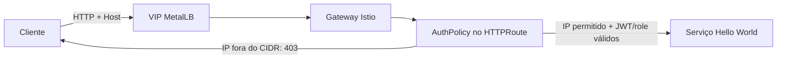

# Allowlist de IP e CIDR por HTTPRoute ou Gateway

## Resultado

O `HTTPRoute` da demonstração é publicado diretamente por um VIP MetalLB. A
allowlist de origem foi validada na `AuthPolicy` do RHCL anexada ao próprio
`HTTPRoute`: uma origem autorizada, com JWT válido, recebeu 200; uma origem
fora da lista, com o mesmo JWT, recebeu 403. A aplicação não foi modificada.



## Opções de escopo

| Opção | Recurso | Escopo | Uso indicado |
|---|---|---|---|
| `AuthPolicy` RHCL | `HTTPRoute` | Uma API/rota | Gateway compartilhado; cada API controla sua allowlist. |
| `AuthorizationPolicy` Istio | `Gateway` | Todas as rotas do Gateway | Gateway dedicado ou regra corporativa comum a todas as rotas. |

A `AuthorizationPolicy` nativa do Istio não pode apontar diretamente para um
`HTTPRoute`. Para obter isolamento por rota, a demonstração usa a primeira
opção: OPA/Rego dentro da `AuthPolicy` do RHCL.

## Implementação validada no HTTPRoute

O `AuthPolicy` já existente para JWT e roles recebeu uma segunda regra de
autorização, chamada `source-cidr`. O Authorino recebe o endereço remoto no
pedido de autorização; no ambiente validado o valor IPv4 contém `IP:porta`, por
isso a regra separa a porta antes de avaliar o CIDR.

```yaml
authorization:
  endpoint-role:
    opa:
      rego: |
        allow {
          input.request.path == "/blue"
          input.auth.identity.realm_access.roles[_] == "blue"
        }

        allow {
          input.request.path == "/red"
          input.auth.identity.realm_access.roles[_] == "red"
        }
  source-cidr:
    opa:
      rego: |
        source_address := input.context.source.address.Address.SocketAddress.address
        source_ip := split(source_address, ":")[0]

        allow {
          net.cidr_contains("198.51.100.18/32", source_ip)
        }

        allow {
          net.cidr_contains("203.0.113.0/24", source_ip)
        }
```

As regras de autorização são cumulativas. A requisição precisa satisfazer a
allowlist de origem e a regra de role. Para uma nova API sem JWT, uma
`AuthPolicy` pode conter somente a regra `source-cidr` e a resposta 403.

O manifesto da demonstração mantém essa regra em
`manifests/04-authpolicy.yaml`. O endereço presente nele é específico do
laboratório e NÃO DEVE ser reutilizado.

## Alternativa no Gateway

Quando todas as rotas de um Gateway devem receber a mesma allowlist, use a
política nativa do Istio:

```yaml
apiVersion: security.istio.io/v1
kind: AuthorizationPolicy
metadata:
  name: example-gateway-source-cidr
  namespace: api
spec:
  targetRef:
    group: gateway.networking.k8s.io
    kind: Gateway
    name: api-gateway
  action: ALLOW
  rules:
    - from:
        - source:
            remoteIpBlocks:
              - 198.51.100.18/32
              - 203.0.113.0/24
```

Com `action: ALLOW`, origens que não correspondem à lista são negadas. Essa
alternativa não foi mantida na demonstração porque bloquearia qualquer outra
rota que compartilhasse o Gateway.

## Validação

Associe o hostname do `HTTPRoute` ao VIP no DNS. Para testar antes da
propagação de DNS, use `curl --resolve`:

```bash
export API_HOST=hello-rbac.api.example.com
export GATEWAY_VIP=192.0.2.50

curl --resolve "${API_HOST}:80:${GATEWAY_VIP}" -i \
  -H "Authorization: Bearer $TOKEN" "http://${API_HOST}/blue" # 200
```

A validação deve conter pelo menos estes cenários:

| Origem | Credencial | Resultado esperado |
|---|---|---:|
| Permitida | JWT válido com role correta | 200 |
| Fora da allowlist | Mesmo JWT válido | 403 |
| Permitida | Sem JWT | 401 |

## Limitações e operação

- A extração Rego apresentada foi validada para IPv4. Para IPv6, implemente e
  teste uma extração de endereço compatível com o formato recebido pelo
  Authorino antes de promover para produção.
- `externalTrafficPolicy: Local` continua necessário para preservar a origem
  em um caminho de rede que entrega o VIP por balanceamento L4.
- Não use `0.0.0.0/0`: isso elimina a restrição de origem.
- Mantenha os CIDRs aprovados, pequenos e revisados; NAT, VPN e proxies podem
  alterar o endereço percebido pela política.

## Referências

- [RHCL 1.4 — autenticação OIDC e AuthPolicy](https://docs.redhat.com/en/documentation/red_hat_connectivity_link/1.4/html/deploy_red_hat_connectivity_link/rhcl-oidc-authentication) — Red Hat, 1.4, consultado em 2026-09-23.
- [Kuadrant 1.4 — AuthPolicy para desenvolvedores e plataforma](https://docs.kuadrant.io/1.4.x/kuadrant-operator/doc/user-guides/auth/auth-for-app-devs-and-platform-engineers/) — documentação community, consultada em 2026-09-23.
- [Authorino — autorização OPA](https://docs.kuadrant.io/1.4.x/authorino/docs/user-guides/opa-authorization/) — documentação community, consultada em 2026-09-23.
- [Istio — políticas de autorização no ingress](https://istio.io/latest/docs/tasks/security/authorization/authz-ingress/) — upstream, consultado em 2026-09-23.
