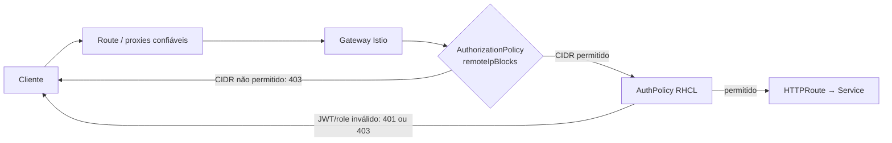

# Allowlist de IP e CIDR no gateway

## Resultado

O `HTTPRoute` `hello-rbac` passou a aceitar tráfego somente de origens previstas
na allowlist, sem alteração no `Deployment`, `Service` ou código da aplicação.
A regra está em `manifests/05-source-cidr-authorization.yaml` e é aplicada no
`Gateway` Istio, antes da validação JWT e das roles do RHCL.



## Como a política funciona

`ipBlocks` avalia o endereço do salto TCP imediato. Como o `Gateway` é exposto
por um `Route` do OpenShift, esse salto é o router, não necessariamente o
cliente. Por isso esta implementação usa `remoteIpBlocks`: no Istio, ele avalia
`remote.ip`, extraído de `X-Forwarded-For` quando o gateway conhece a quantidade
correta de proxies confiáveis.

No laboratório, a anotação abaixo foi propagada pelo controller Istio ao Pod
gerado para o `Gateway`. O valor `1` corresponde a um proxy de encaminhamento
confiável naquele caminho; ele **não é um valor universal**.

```yaml
spec:
  infrastructure:
    annotations:
      proxy.istio.io/config: '{"gatewayTopology":{"numTrustedProxies":1}}'
```

O manifesto da política contém uma entrada `/32` ativa para a origem de teste.
Em outro ambiente, substitua-a por endereços e redes aprovados. Exemplo
anônimo, com um IP individual e um bloco CIDR:

```yaml
spec:
  targetRef:
    group: gateway.networking.k8s.io
    kind: Gateway
    name: hello-gateway
  action: ALLOW
  rules:
    - from:
        - source:
            remoteIpBlocks:
              - 198.51.100.18/32
              - 203.0.113.0/24
```

Uma `AuthorizationPolicy` com `action: ALLOW` passa a negar tudo que não case
com alguma regra `ALLOW` aplicável. Assim, a ausência de uma regra de origem é
um bloqueio efetivo, não apenas uma preferência de roteamento.

## Limite de confiança

O cabeçalho XFF não deve ser aceito de qualquer origem. O mesmo manifesto cria
uma `NetworkPolicy` para o Pod do gateway: a porta 80 aceita somente tráfego do
namespace `openshift-ingress`, enquanto a porta de saúde 15021 continua
acessível. O `Service` gerado pelo Istio também é `ClusterIP`. Juntas, essas
medidas evitam que um workload arbitrário alcance a porta HTTP do gateway e
invente uma cadeia XFF.

Antes de escolher `numTrustedProxies`, mapeie o caminho real: CDN/WAF,
balanceador, router e gateway. Todos os proxies contados precisam remover ou
acrescentar XFF de modo controlado. Um número menor ou maior seleciona o IP
errado; se houver menos entradas XFF do que o esperado, o Envoy recua para o
endereço TCP imediato. Não use o IP observado neste laboratório como parâmetro
de outro ambiente.

## Aplicação e validação

Com o Service Mesh já instalado e os hosts/JWT definidos conforme o guia
principal, aplique a configuração do `Gateway` e a política:

```bash
oc apply -f manifests/03-hello-gateway.yaml
oc apply -f manifests/05-source-cidr-authorization.yaml

oc get gateway,authorizationpolicy,networkpolicy -n hello-rbac
oc get gateway hello-gateway -n hello-rbac \
  -o jsonpath='{range .status.conditions[*]}{.type}={.status}{" "}{end}{"\n"}'
```

Resultados esperados para a origem cadastrada:

```bash
curl -i -H "Authorization: Bearer $TOKEN" "https://${API_HOST}/blue" # 200
curl -i -H "Authorization: Bearer $TOKEN" "https://${API_HOST}/red"  # 403 (role)
curl -i "https://${API_HOST}/blue"                                  # 401 (JWT)
```

De uma rede que não pertence a `remoteIpBlocks`, o mesmo JWT em `/blue` deve
retornar 403. Teste isso com um runner independente ou uma rede controlada;
não conclua que a política funciona somente porque um JWT inválido também dá
403. Como teste adicional de confiança, envie um `X-Forwarded-For` inventado a
partir de uma origem permitida: com a contagem de proxies correta, o resultado
permanece autorizado e o IP inventado não passa a ser a identidade de origem.

Após qualquer alteração de topologia, confira a configuração realmente recebida
pelo proxy e repita a matriz de testes. Um exemplo de inspeção de diagnóstico
(restrinja o acesso a administradores) é:

```bash
POD="$(oc -n hello-rbac get pod -l gateway.networking.k8s.io/gateway-name=hello-gateway \
  -o jsonpath='{.items[0].metadata.name}')"
oc -n hello-rbac exec "$POD" -c istio-proxy -- \
  pilot-agent request GET config_dump | grep -A1 xff_num_trusted_hops
```

## Suporte e adoção

O `AuthorizationPolicy` e a autorização externa são GA no OpenShift Service
Mesh 3.4.2. Entretanto, a própria tabela de suporte da Red Hat classifica
*Gateway network topology configuration* como Developer Preview; a página
upstream do Istio também classifica a topologia de gateway como Alpha. Portanto,
esta implementação é uma PoC validada tecnicamente, não uma recomendação de
produção suportada nessa combinação de versões. Para workloads críticos, valide
o desenho com a Red Hat e implemente a allowlist em uma camada de borda suportada
(WAF, load balancer ou ingress corporativo), mantendo esta política apenas se o
nível de suporte atender ao risco.

## Referências

- [Istio — controle de acesso no ingress](https://istio.io/latest/docs/tasks/security/authorization/authz-ingress/) — upstream, consultado em 2026-09-23.
- [Istio — topologia de rede do gateway](https://istio.io/latest/docs/ops/configuration/traffic-management/network-topologies/) — upstream, consultado em 2026-09-23.
- [OpenShift Service Mesh 3.4 — níveis de suporte](https://docs.redhat.com/en/documentation/red_hat_openshift_service_mesh/3.4/html/release_notes/ossm-release-notes-feature-support-tables) — Red Hat, 3.4.2, consultado em 2026-09-23.
