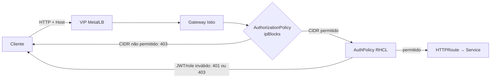

# Allowlist de IP e CIDR no gateway

## Resultado

O `HTTPRoute` `hello-rbac` é publicado diretamente por um VIP do MetalLB. A
`AuthorizationPolicy` avalia o endereço IP da conexão recebida pelo Gateway e
nega origens que não pertencem à allowlist, sem alteração no `Deployment`,
`Service` da aplicação ou código.

Este é o guia da segunda entrega e pressupõe a configuração de realm, cliente,
JWT e roles descrita em [OIDC/JWT e RBAC por endpoint](jwt-rbac.md).



## Decisões e pré-requisitos

O gateway gerenciado pelo Istio é exposto como `Service` do tipo
`LoadBalancer`. O MetalLB aloca um IP de um `IPAddressPool` reservado e o
anuncia por L2. A rede externa DEVE encaminhar esse bloco até os nós do cluster;
reservar um endereço livre, roteável e fora de DHCP é responsabilidade da equipe
de rede.

O serviço também usa `externalTrafficPolicy: Local`. Com um balanceador L4 que
preserva origem, essa opção evita o encaminhamento por kube-proxy a outro nó e
permite que o gateway avalie o IP do cliente. Em produção, RECOMENDA-SE ter um
Pod de gateway nos nós que podem anunciar o VIP; caso contrário, uma falha ou
ausência de Pod local pode indisponibilizar a entrada.

Como o cliente se conecta diretamente ao VIP neste desenho, a política usa
`ipBlocks`, que avalia o endereço remoto da conexão.

## Manifestos e ordem de aplicação

1. `00b-metallb-operator.yaml` instala o operador MetalLB no namespace
   `metallb-system`.
2. `01a-metallb.yaml` cria a instância, o `IPAddressPool` e o
   `L2Advertisement`. Ajuste o intervalo do pool para a rede do seu ambiente.
3. `03-hello-gateway.yaml` solicita um `LoadBalancer` para o Gateway e associa
   o serviço ao pool por `metallb.io/address-pool`.
4. `03b-gateway-loadbalancer.yaml` aplica `externalTrafficPolicy: Local` ao
   serviço que o controller Istio gera, usando server-side apply.
5. `05-source-cidr-authorization.yaml` aplica a allowlist no Gateway.

O exemplo abaixo é ilustrativo; use apenas endereços aprovados para o ambiente.
Um `/32` é um IP individual, e um prefixo menor cobre uma rede:

```yaml
apiVersion: security.istio.io/v1
kind: AuthorizationPolicy
metadata:
  name: example-source-cidr
  namespace: api
spec:
  targetRef:
    group: gateway.networking.k8s.io
    kind: Gateway
    name: api-gateway
  action: ALLOW
  rules:
    - from:
        - source:
            ipBlocks:
              - 198.51.100.18/32
              - 203.0.113.0/24
```

Uma `AuthorizationPolicy` com `action: ALLOW` nega toda origem que não case
com uma regra aplicável. O IP de teste presente no manifesto deste repositório
é específico do laboratório e NÃO DEVE ser reutilizado.

Após a criação do Gateway, aplique a configuração do serviço gerado assim:

```bash
oc apply -f manifests/03-hello-gateway.yaml
oc apply --server-side -f manifests/03b-gateway-loadbalancer.yaml
oc apply -f manifests/05-source-cidr-authorization.yaml
```

## DNS, consumo e validação

Associe o hostname do `HTTPRoute` ao VIP no DNS. Enquanto o DNS não estiver
publicado, `curl --resolve` permite testar a combinação de VIP e host sem mudar
`/etc/hosts`:

```bash
export API_HOST=hello-rbac.api.example.com
export GATEWAY_VIP=192.0.2.50

oc get svc hello-gateway-istio -n hello-rbac
oc get ipaddresspool,l2advertisement -n metallb-system
oc get gateway hello-gateway -n hello-rbac

curl --resolve "${API_HOST}:80:${GATEWAY_VIP}" -i \
  -H "Authorization: Bearer $TOKEN" "http://${API_HOST}/blue" # 200
curl --resolve "${API_HOST}:80:${GATEWAY_VIP}" -i \
  -H "Authorization: Bearer $TOKEN" "http://${API_HOST}/red"  # 403 (role)
curl --resolve "${API_HOST}:80:${GATEWAY_VIP}" -i \
  "http://${API_HOST}/blue" # 401 (JWT)
```

Repita a chamada autenticada a partir de uma rede fora da lista. O resultado
esperado é 403. A validação deve incluir uma origem permitida e uma não
permitida: testar apenas JWT ou role inválidos não prova a restrição de rede.

Se o VIP não responder, confirme primeiro se o `Service` contém
`EXTERNAL-IP`, se há um `ServiceL2Status` para o serviço e se o IP do pool é
alcançável a partir da rede do consumidor. Se a origem esperada recebe 403,
confirme `externalTrafficPolicy: Local`, os Pods de gateway locais e o IP visto
na conexão; não amplie o CIDR sem identificar a causa.

## Segurança e suporte

Esta PoC usa HTTP para focalizar o controle de origem. Em produção, o Gateway
DEVE expor HTTPS, usar certificado administrado e ter o DNS do hostname apontado
para o VIP. MetalLB fornece a exposição L4; autenticação JWT, roles e políticas
continuam no Gateway/RHCL.

O MetalLB Operator do OpenShift 4.22 é a fonte normativa para instalação, pool
e anúncios. A documentação upstream do Istio fundamenta o uso de
`externalTrafficPolicy: Local` com `ipBlocks` quando o balanceador L4 preserva
o IP de origem. Valide a topologia de rede, a disponibilidade e o modelo de
anúncio L2/BGP com a equipe de plataforma antes de produção.

## Referências

- [OpenShift 4.22 — MetalLB Operator](https://docs.redhat.com/en/documentation/openshift_container_platform/4.22/html/networking_operators/metallb-operator) — Red Hat, 4.22, consultado em 2026-09-23.
- [OpenShift 4.22 — anúncios L2 do MetalLB](https://docs.redhat.com/en/documentation/openshift_container_platform/4.22/html-single/ingress_and_load_balancing/index) — Red Hat, 4.22, consultado em 2026-09-23.
- [Istio — controle de acesso no ingress](https://istio.io/latest/docs/tasks/security/authorization/authz-ingress/) — upstream, consultado em 2026-09-23.
